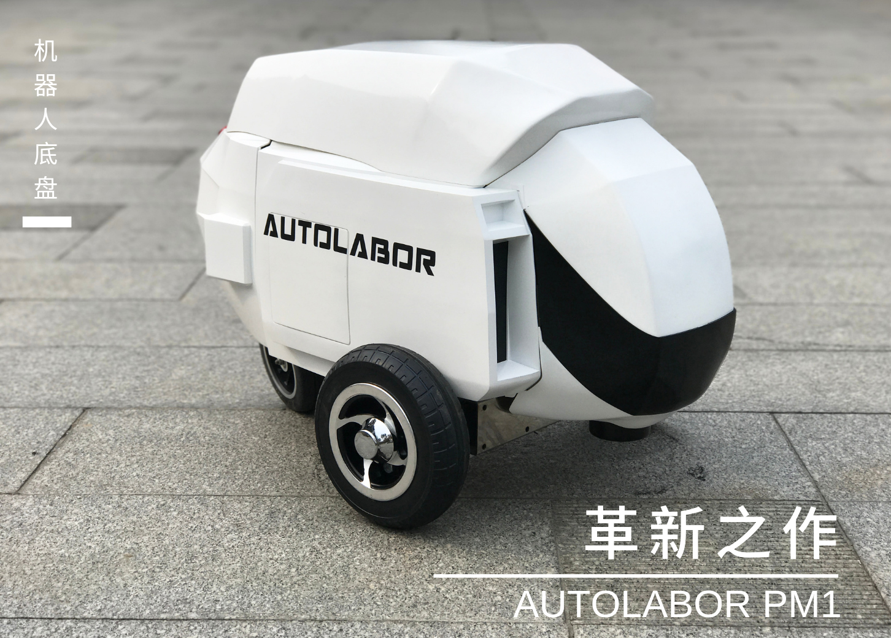
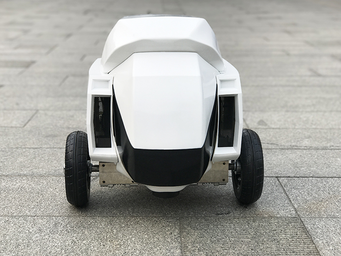
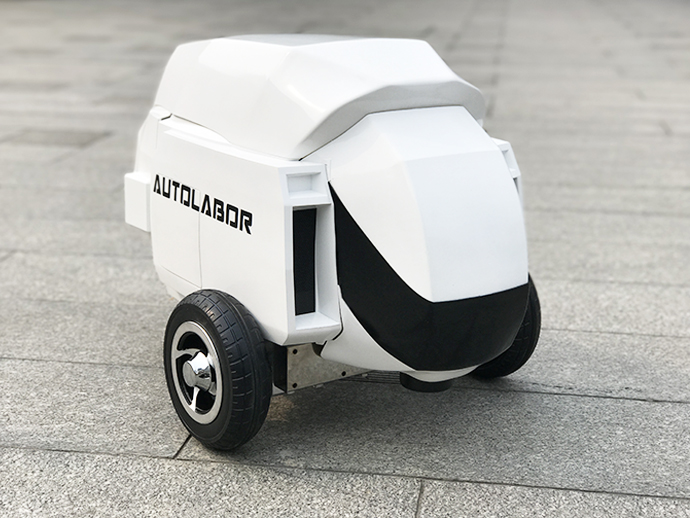
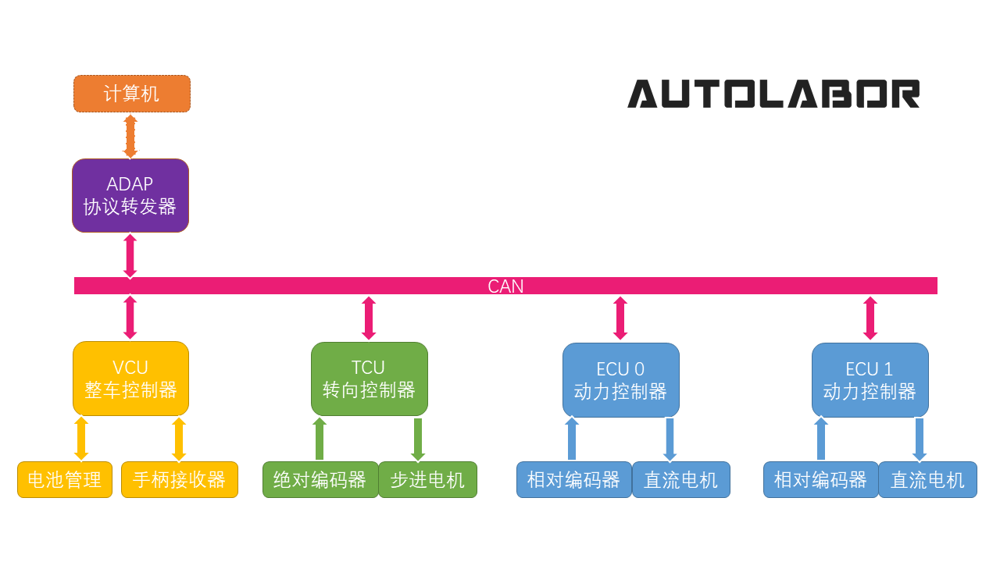
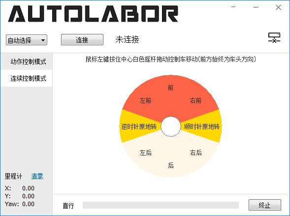

# 产品介绍

Autolabor PM1 是一款内外革新的机器人底盘，由全新材料打造，充满科幻感的外形，重新定义机器人底盘形态。

## 产品特性

机械采用独有结构设计，两动力驱动前轮与主动转向后轮配合的稳定三轮，运动更加灵活精准。

原地转向无侧滑，有一定的越障功能，载重能力更强，独特的结构使得产品能源利用率更高。

各单元采用模块化设计，便于产品迭代。

***

内部通信采用汽车级CAN协议，稳定可靠保障数据安全，电气控制系统模块化，便于扩展底盘功能。

标准规格铅酸蓄电池，高精度电量统计，且提供数据查询接口。

***

提供开机即用的可视化的控制软件，操作简单，可让机器人完成指定动作（直行/转弯指定的距离/角度），同时也可以操作方向盘自由控制。

***

代码全部开源，支持Windows/Linux多平台开发，支持多种语言开发（C++/C#）,提供简单易用，方便灵活的控制接口，文档详细，提供大量示例代码，提供底盘ROS驱动。

[使用文档](/usedoc/pm1/user-guide/using-gamepad/doc)
