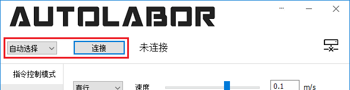
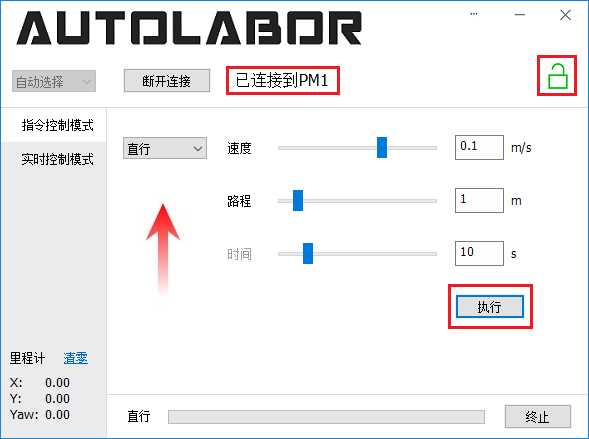
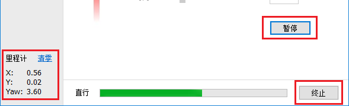
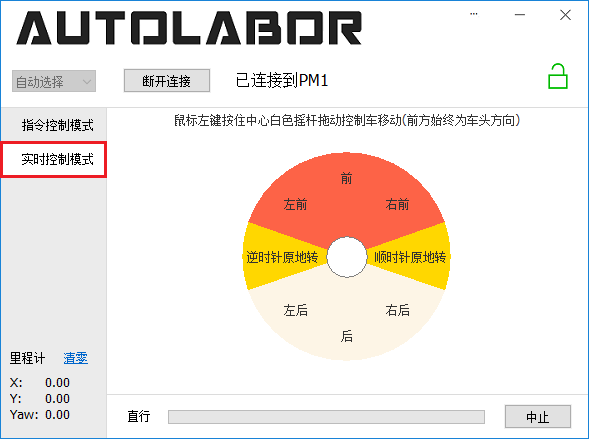

# PM1 快速开始

## 检查收货清单

收件后打开包装，对照产品装箱单/发货清单进行清点，如有短缺请于三日内联系客服，过期不补。

## 充电

查看电量显示，如果电量不足请充电。

**TODO**电量显示、充电教程

## 无线手柄控制

使用手柄控制 PM1 运动，请按如下步骤操作

1. 确保 PM1 电量充足，打开 PM1 开关，确认急停按钮释放

2. 等待手柄连接到 PM1，连接完成后手柄上的两个红色 LED 同时慢闪（约每秒点亮一次）

3. 同时按住【LT】 【RT】【start】 三个按键 或 【LB】 【RB】【start】三个键解锁PM1

4. 按住手柄上方的【LB】 或【LT】进入左方向和左摇杆控制，按住【LT】 或【RT】按键为左摇杆控制

5. 参考下图的手柄按键定义控制 PM1 运动

## 软件控制

使用 PM1 Starter 控制

1. 电脑连接 PM1
   
   【TODO 驱动安装 硬件连接 链接】

2. 软件连接 PM1

   打开 PM1 Starter，串口默认自动选择，点击 `连接` 按钮开始连接 PM1，如下图所示。

   

   成功连接 PM1 之后，连接提示信息会显示 `已连接到PM1`，右侧 PM1 状态图标会显示锁定或者解锁图标，如下图所示。如果状态图标显示的是锁定，需要点击该图标解锁，解锁完成后图标变为解锁图标。

3. 执行指令

   确保 PM1 前方有至少1m的可行驶区域，指令类型与参数保持默认，点击 `执行` 按钮开始以0.1m/s的速度向前直行1m，如下图所示。

   

   指令执行过程中可以通过点击 `暂停` 按钮暂停执行（快捷键空格），或者点击 `终止` 按钮终止执行（快捷键Esc）。左下角显示里程计信息，点击 `清零` 可重置里程计。如下图所示。

   

4. 摇杆控制

   点击左侧 `实时控制模式` 标签切换到摇杆控制模式。鼠标左键按住摇杆中心白色圆圈向不同区域拖动实现对应的控制。摇杆界面如下图所示。

   

5. 了解更多

    更多详细信息请参考 [PM1 Demo 用户手册](https://github.com/autolaborcenter/pm1_document/blob/master/pm1_demo_user_manual/doc.md)。

## 开发

提供C++/C#/ROS开发组件，查看对应文档了解详细信息

|  组件 | 文档   |  Windows   |  Linux |
|-------|---------|--------|---------- |
| C++ API | [PM1 C++ 参考]()  | √ |  |
| C# API  |  [PM1 C# 参考]() | √    |   |
| ROS驱动 |  [PM1 ROS 参考]() |      | √ |

## 例程

可参考例程帮助使用开发组件

|  组件 | 例程文档   |  例程列表  |
|-------|---------|--------|
| C/C++ API | [PM1 C++ 例程介绍]()  | [初始化]() |
|                   |                | [动作控制]() |
|                   |                | [连续控制]() |
| C# API  |  [PM1 C# 例程介绍]() | [初始化]() |
|                   |                | [动作控制]() |
|                   |                | [连续控制]() |
| ROS驱动 |  [PM1 ROS 例程介绍]() | |

