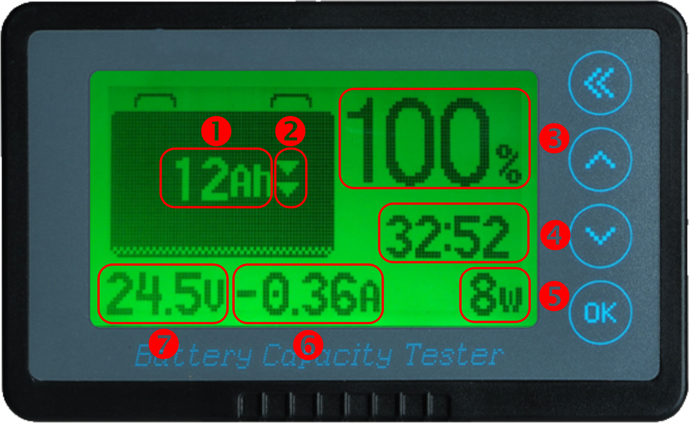
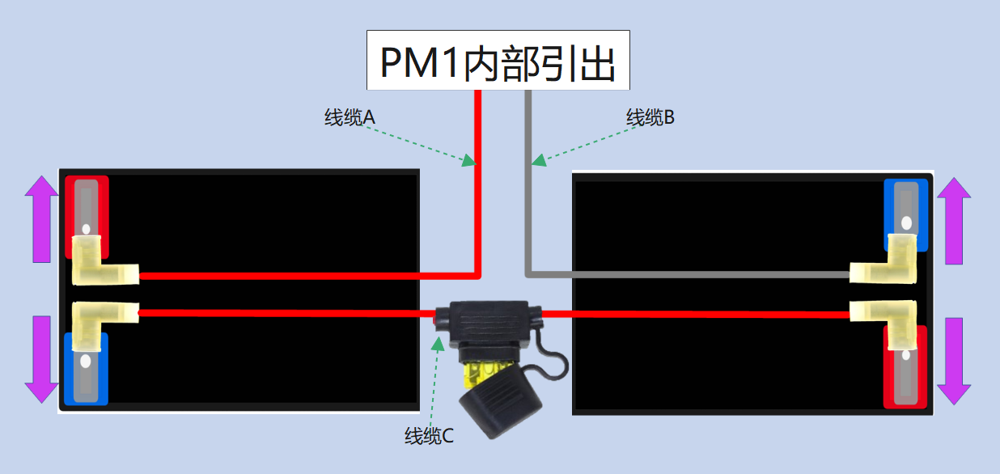
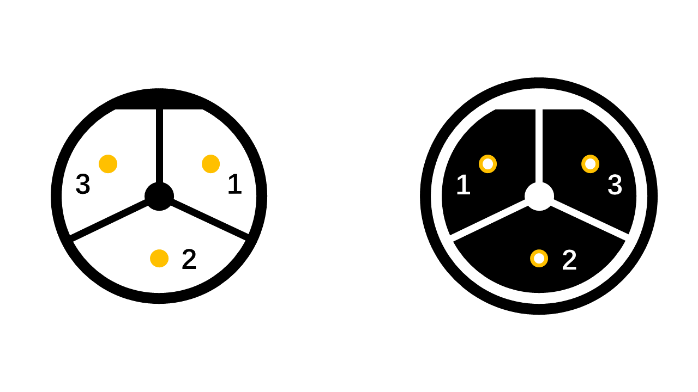

# 电池及相关

## 电池参数

* 规格（单只）

| 额定电压 | 额定容量  | 外形尺寸               |
| :------ | :------- | :--------------------- |
| 12 V    | 12 Ah    | 151 * 99 * 97 (±2) mm  |
       
* 性能（单只）

| 温度        | 40 ℃   |25 ℃    | 0 ℃   | -15 ℃   | 
| :---------- | :----- | :------ | :----- | :------- |
| 容量（3hr） | ≈ 102 % | ≈ 100 % | ≈ 85 % | ≈ 70 %   |

* 容量衰减（单只）

| 时长     | 3个月   | 6个月   | 9个月   | 12个月    |
| :------  | :------ | :------ | :------ | :------ |
| 容量     | ≥ 90 %  | ≥ 80 % | ≥ 70 %  | ≥ 60 %    |

* 以下做法可以减缓电池老化、性能下降的速度：

  * 若长期不使用 PM1 ，请三个月左右进行一次充电

  * 不建议将电池内电量彻底耗尽，这可能会对电池造成不可逆的伤害

  * 将电池存放在干冷的环境，建议存放温度为 10 - 30 ℃

* 注意

    PM1 处于非工作状态下，若电池电压低于 21.0 V（放电截止电压），请立即进行充电。
    
## 电池指示

* 屏幕内容：

|  序号   | 释义  |
|  ----  | ----  |
| 1  | 剩余电量 |
| 2  | 充放电指示符，充电时为 `︽`，放电时为 `︾` |
| 3  | 剩余电量百分比 |
| 4  | 剩余时间，充电时为距离充满所需时间（根据当前充电功率估算），放电时为剩余可用时间（根据当前负载功率估算） |
| 5  | 实时功率 |
| 6  | 实时电流，充电时为正，放电时为负 |
| 7  | 实时电压 |

* 背光：

|  状态   | 释义  |
|  ----  | ----  |
| 背光`呼吸`  | 充电中  |
| 背光`常亮`  | 放电中  |
| 背光`关闭`  | 无充放电 |

* 其他：
  * 当电池正在充电，且底盘提供的电源输出（XT60）接有其他负载工作时，**负载的电流来自充电器而非电池**（负载功率小于充电器最大功率）；指示器上显示的电流和功率为电池的充电电流/功率，而非充电器输出的电流/功率。

## 容量校准

随着使用次数增多，电池管理系统可能无法准确反映电池的真实容量，你可能需要对电池容量进行校准。

* 简单校准

  单次充电持续 6-8 小时以上即可

* 进阶校准

  手动调整电池管理系统的电池容量，并执行一次持续 6-8 小时以上的充电

## 更换电池

* 请使用 `6-DZF-12` 型号的铅酸蓄电池

* 我们提供的接线端子为 `FLDNY-6.3mm 旗形插簧` 

* 更换电池时请注意正负极性，以免对人身或财产安全造成威胁

电池连线示意图

## 电源适配器

为保证安全，请使用随产品附送的电源适配器为 PM1 充电

* 电源适配器工作状态：

    * **红灯**亮起，处于**充电**状态

    * **绿灯**亮起，处于**满电**状态或**尚未充电**状态

* 接口定义：

| 序号     | 1        | 2      | 3      |  
| :------  | :------ | :------ |:------ |
| 功能     | 电源     | 预留    | 地     | 
    

充电接口示意：左侧为电源适配器端接口，右侧为PM1设备端接口。

## 常见问题

Q&A

* “为什么要使用能量密度低的铅酸蓄电池，而不是用锂电池？”

  “因为我们不喜欢拿生命安全开玩笑，无论是我的，你的，还是其他任何人的。”

  “铅酸蓄电池执行统一的国家/国际标准，有助于你在世界各地购买到同型号的电池，而不必担心兼容问题。”

* “为什么库仑计显示的容量比电池容量小？”
  
  “我们特意将库仑计设置的比电池实际容量小一些，旨在防止电池过度放电。”

* “为什么会听到蜂鸣器 `滴` 声响个不停？”

  “当剩余电量低于 1Ah 时，PM1 会每隔 10 秒发出一次 `滴` 声以提示你为 PM1 充电。”
