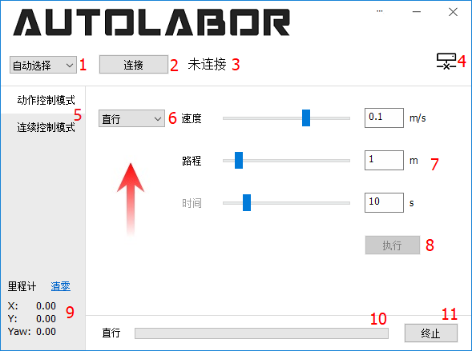
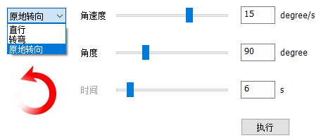
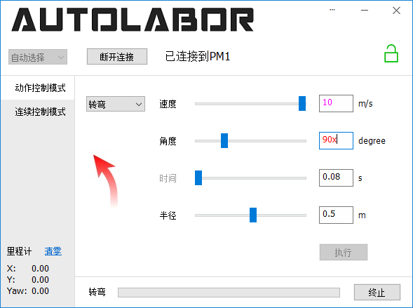
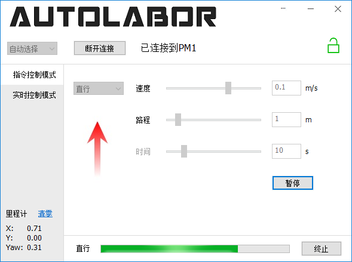

# 使用 PM1 Starter

## 软件概述

本软件为 PM1 产品的移动功能演示工具，包含动作控制与连续控制两种模式。

软件与 PM1 成功连接之后，可以控制车辆进行直行、转弯以及原地转向动作，也可以使用虚拟摇杆或键盘方向键对车辆进行连续控制。

软件开源，可[下载](https://github.com/autolaborcenter/PM1Starter/releases)或[查看源码](https://github.com/autolaborcenter/PM1Starter)。

运行环境：Windows（支持 Win7 及以上）。

软件主界面如下图所示：

1. 串口选择（电脑所有串口号列表/自动选择/自定义）

2. 连接/断开连接

3. 连接状态提示

4. 连接/锁定状态图标（未连接/已连接/已锁定/已解锁/错误状态）

5. 控制模式选择

6. 动作选择（直行/转弯/原地转向）

7. 参数设置

8. 动作执行/暂停/恢复

9. 里程计数据/清零

10. 动作执行进度指示

11. 终止动作

## 连接 PM1

【TODO硬件连接（USB串口、无线串口、蓝牙）】

本软件通过串口与 PM1 通信，连接 PM1 之后电脑会检测到相应串口。如下图所示，软件串口选择下拉框提供了三种设置串口的方式：

* 选择串口并连接：下拉列表中会列出电脑上所有串口

* 自动选择串口并连接：自动扫描所有串口并选择第一台 PM1

* 自定义：手动输入串口名字并连接

设置好串口后，点击**连接**按钮开始连接 PM1，连接成功或失败状态会显示在按钮右侧。连接成功后连接按钮变为**断开连接**，点击可断开与 PM1 的连接并关闭串口。

 

> 注意：硬件连接后 PM1 关机状态下也能被电脑检测到相应串口，但此时软件无法连接到 PM1，因此软件连接前请**确保 PM1 开机**。

## PM1 锁定状态

连接 PM1 之后，软件会定时查询 PM1 状态并在右上角显示。一共有**未连接**、**连接**、**锁定**、**解锁**、**错误**5种状态，图标依次如下图所示。

*  未连接到 PM1
*  连接到 PM1 且未查询到锁定状态时的临时状态
*  PM1 锁定、解锁前不响应任何动作
*  PM1 未锁定，正常工作状态
*  PM1 出现错误，不能正常工作

其中锁定与解锁状态可以主动切换，锁定状态下鼠标左键点击锁定图标进行解锁，解锁状态下鼠标左键点击解锁图标锁定 PM1，如下图所示。

注意：锁定状态下 PM1 无法运动。

 

## 动作控制模式

PM1 支持三种基本动作控制，包括**直行**、**转弯**与**原地转向**。

选择一种动作，设置好运动参数之后点击执行按钮开始执行相应动作，如下图所示。

注意：连接 PM1 之前执行按钮处于灰色无法点击状态，需要先成功连接PM1后执行按钮才能点击。

参数可以通过拖动滑块或者直接键盘输入参数值设置，不同参数值对应不同的运动状态，左侧箭头表示当前参数下 **PM1 视角**的运动方向。

注意：箭头只是示意大致的运动方向（前、左前、右前、后、左后、右后、逆时针原地转、顺时针原地转），不反映参数细节。

鼠标左键单击箭头可切换运动方向，相应参数自动修改。

键盘输入参数时，要输入合法的数值且不能超出参数允许的范围，否则执行按钮为灰色无法点击状态。

参数编辑框中输入**非数值**内容时字体会变为红色，输入数值**超出**参数允许范围时，字体会变为紫罗兰色。如下图所示：

由于动作控制模式有按路程/角度或者按时间两种控制模式，因此参数设置存在冗余。

以直行为例，速度、路程与时间三个量都可以设置。修改速度或路程时，时间值会自动调整，修改时间时，路程值会自动调整。

如果动作执行之前**最后一次手动调整**的参数是时间的话，将会执行时间模式动作（此时时间参数名称为黑色，路程/角度参数名称为灰色），否则将执行路程模式动作（此时路程/角度参数名称为黑色，时间参数名称为灰色），其他动作同理。

  

开始执行后，下方进度条指示动作执行进度，点击右侧**终止**按钮或者按下 **Esc** 键可终止当前正在执行的动作，PM1 将急停。

动作开始执行后通过**执行（暂停/恢复）**按钮或者**空格键**可进行暂停与恢复操作，该操作仅在动作控制模式界面下有效。

 

### 直行

直行动作控制 PM1 前进或后退。

速度参数设置运动线速度，正值前进负值后退。

设定速度后可以设定目标运行的路程或者时间，二者设置一个后另一个会自动计算取值，修改速度也会自动重新计算时间。参数取值范围见下表：

| 参数 | 滑块                | 输入框              | 默认值 |
| ---- | ------------------ | ------------------- | ----- |
| 速度 | [-0.3m/s, 0.3m/s]  | [-0.3m/s, 0.3m/s]   | 0.1m/s |
| 路程 | [0m, 10m]          | [0m, 100000m]       | 1m     |
| 时间 | [0s, 60s]          | [0s, 100000s]       | 10s    |

注：PM1 最大线速度可达 ± 1m/s，为保证控制安全，在软件中对速度参数进行了限制，非 PM1 实际最大/小速度。

### 转弯

转弯动作除了速度、角度/时间外，还有一个半径参数。

速度设置运动的**线速度**，正值前进负值后退。

半径设置转弯半径，正值向左转负值向右转。

角度参数设置需要转过的角度，时间参数设置转弯动作持续的时间，二者设置一个后另一个会自动计算取值，修改速度或半径也会自动重新计算时间。参数取值范围见下表：

| 参数  | 滑块                | 输入框              | 默认值  |
| ----- | ------------------ | ------------------- | ------ |
| 速度  | [-0.3m/s, 0.3m/s]  | [-0.3m/s, 0.3m/s]   | 0.1m/s |
| 角度  | [0°, 360°]         | [0°, 100000°]       | 90°    |
| 时间  | [0s, 60s]          | [0s, 100000s]       | 7.85s  |
| 半径  | [-10m, 10m]        | [-100000m, 100000m] | 0.5m   |

注：PM1 最大线速度可达 ± 1m/s，为保证控制安全，在软件中对速度参数进行了限制，非 PM1 实际最大/小速度。

### 原地转向

原地转向动作控制 PM1 顺时针或者逆时针原地转。

角速度参数设置原地转**角速度**，正值逆时针转负值顺时针转。

角度参数设置需要转过的角度，时间参数设置原地转动作持续的时间，二者设置一个后另一个会自动计算取值，修改角速度也会自动重新计算时间。参数取值范围见下表：

|  参数 | 滑块                | 输入框          | 默认值  |
| ----- | ------------------ | --------------- | ------ |
| 速度  | [-45°/s, 45°/s]    | [-45°/s, 45°/s] | 15°/s  |
| 角度  | [0°, 360°]         | [0°, 100000°]   | 90°    |
| 时间  | [0s, 60s]          | [0s, 100000s]   | 6s     |

## 连续控制模式

连续控制模式使用**虚拟摇杆**或者**键盘方向键**控制 PM1 移动。方向基于 **PM1 视角**，即摇杆前方/上键始终为车头方向。

鼠标左键按住中心白色摇杆拖动控制 PM1 移动，松开后自动回中 PM1 运动停止。

### 虚拟摇杆控制

摇杆活动范围分为前后左右四个区域，分别为前向直行转弯、后退直行转弯、逆时针原地转、顺时针原地转功能区，如下图所示。

对于前后区域，上下离中心越远运动速度越大，左右离中心越远转弯半径越小。

对于左右区域，离中心越远原地转角速度越大。摇杆控制运动速度上限为 0.3m/s，原地转角速度上限为 45°/s。

### 键盘方向键控制

键盘方向键控制一共有 8 个固定的运动模式：

* 上键：向前直行；

* 上键+左键：向左前方转弯；

* 上键+右键：向右前方转弯；

* 下键：后退直行；

* 下键+左键：向左后方后退转弯；

* 下键+右键：向右后方后退转弯；

* 左键：逆时针原地转向；

* 右键：顺时针原地转向。

* 摇杆与键盘方向键同时操作时，**以摇杆为准**。

当 PM1 正在执行动作控制模式发出的命令过程中，将控制模式切换至连续控制后无法使用摇杆或者键盘方向键进行控制，须**等待动作执行完毕**或者**终止动作**后再进行连续控制。

## 里程计数据

PM1 连接后开始刷新显示里程计数据，此时 PM1 位姿为里程计坐标系原点以及 0 航向角。

X 坐标为车头方向，单位米。

Y 坐标为车左侧方向，单位米。

Yaw 为航向角，单位度。

PM1 连接状态下可点击清零复位里程计坐标系。
